# Cybergame Management System

Đây là hệ thống giúp người quản lý tiệm cyber có thể quản lý khách hàng, nhân viên và doanh thu hàng tháng, hàng năm của tiệm.

## Tính Năng Nổi Bật

- Quản lý khách hàng
- Quản lý nhân viên
- Quản lý máy tính
- Quản lý dịch vụ đồ ăn, thức uống
- Thống kê doanh thu theo tháng, theo năm

## Cài Đặt

### Yêu cầu hệ thống
- Java JDK 11+
- SQL Server 2019+
- NetBeans IDE (khuyến nghị)

### Hướng dẫn cài đặt:

```bash
git clone https://github.com/NguyenHungCuongg/Cybergame-Management-System.git
```
### Tài khoản quản lý

```bash
username: Cuongg
password: 123456
```

### Hỗ trợ
-  Liên hệ:
-  Facebook: https://www.facebook.com/cuong.nguyen.813584
-  Email: cuonghungnguyentop@gmail.com

# Giao diện
### Khung đăng nhập
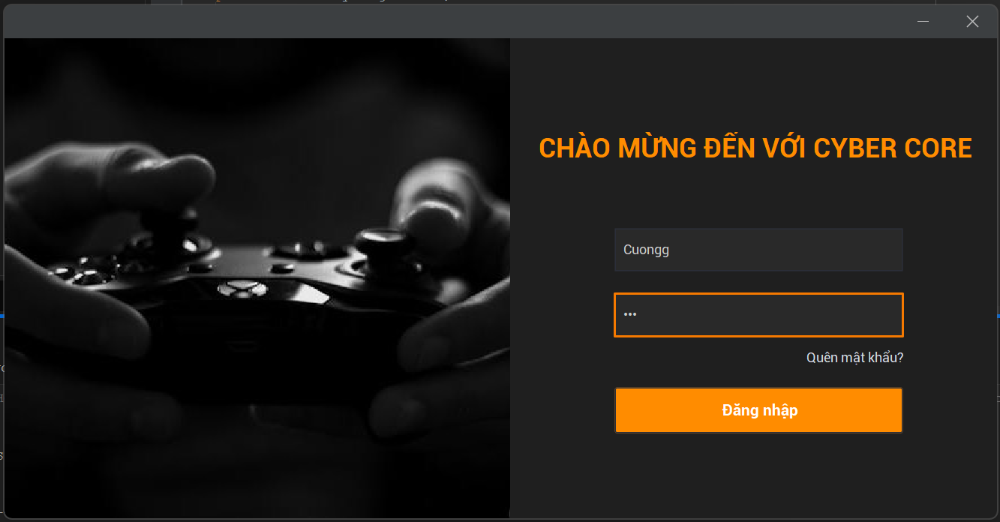

### Dialog gửi mã qua email khi quên mật khẩu
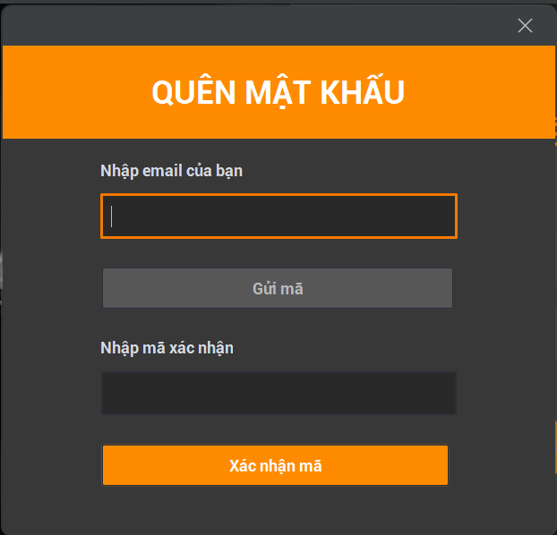 

### Trang chủ Dashboard
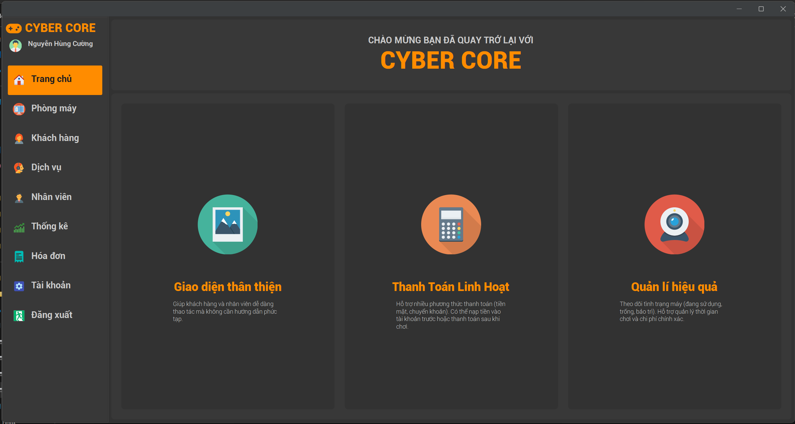

### Phòng máy Dashboard
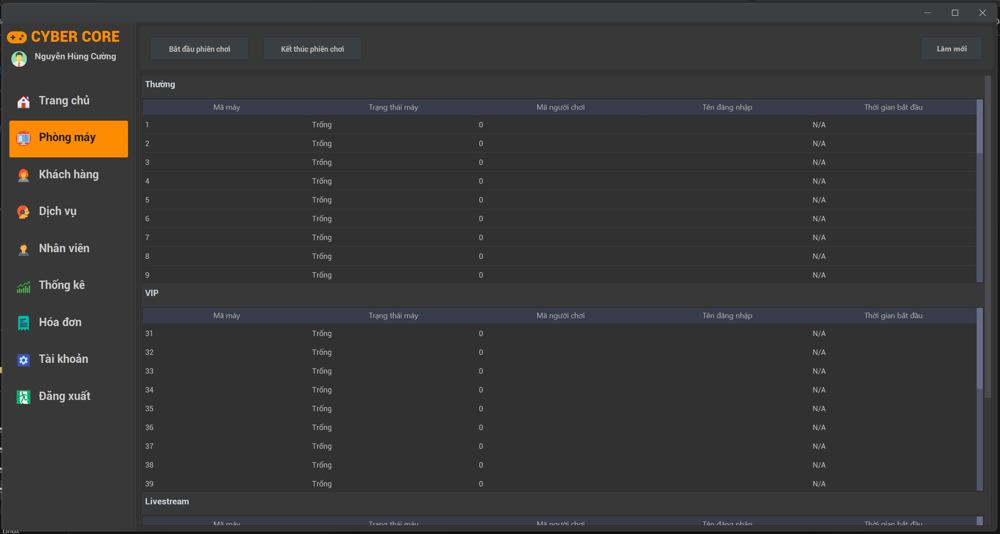

### Quản lý khách hàng Dashboard (gần như tương tự với quản lý nhân viên)
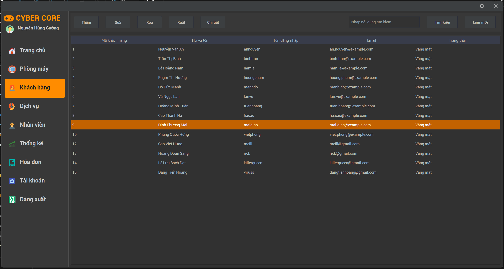

### Dialog thêm khách hàng (gần như tương tự với thêm nhân viên)
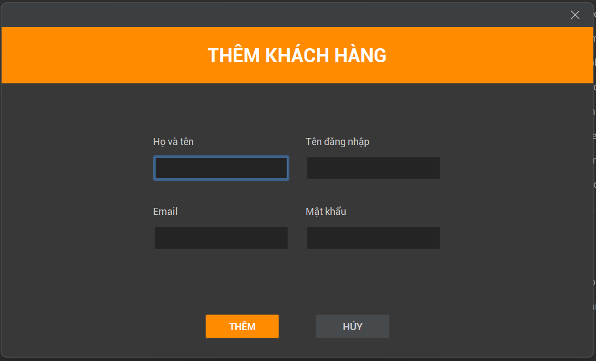

### Dialog xuất một bảng (nhân viên, khách hàng, hóa đơn)
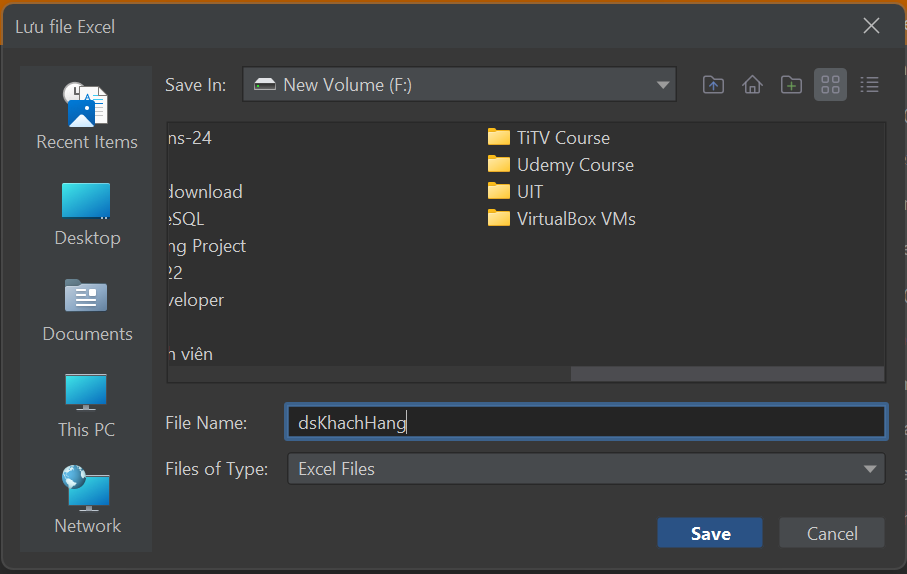

### Dịch vụ đồ ăn thức uống Dashboard
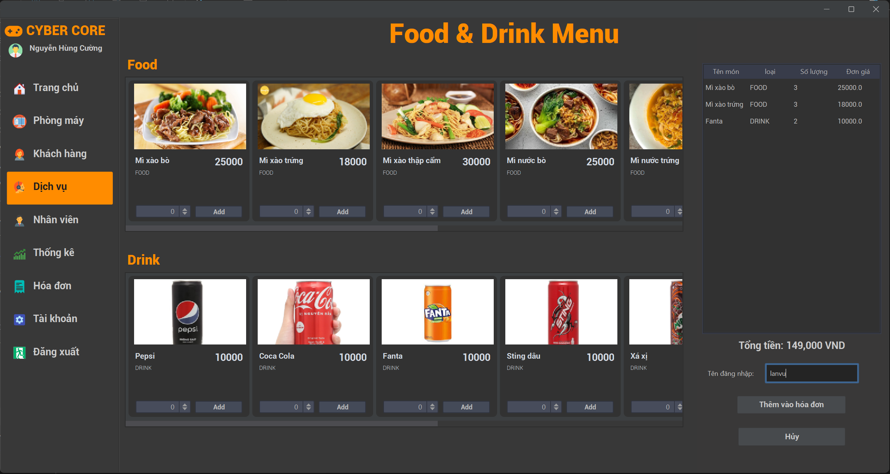

### Thống kê Dashboard
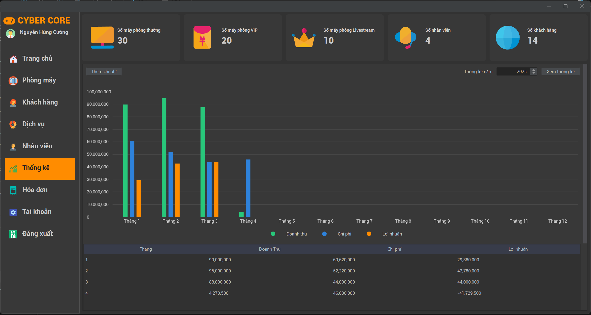

### Dialog nhập chi phí tháng
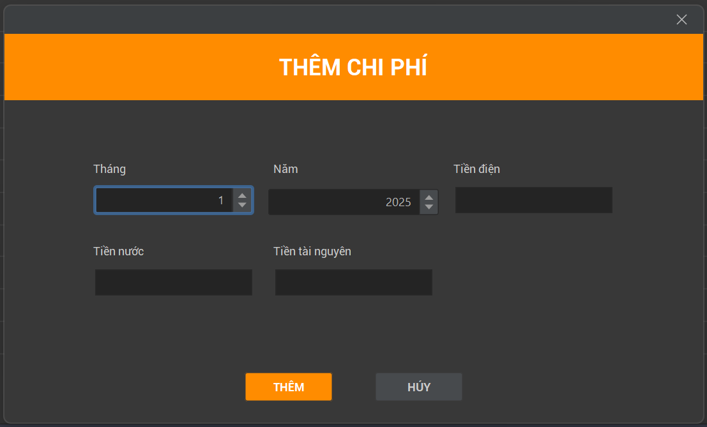

### Dialog thanh toán hóa đơn
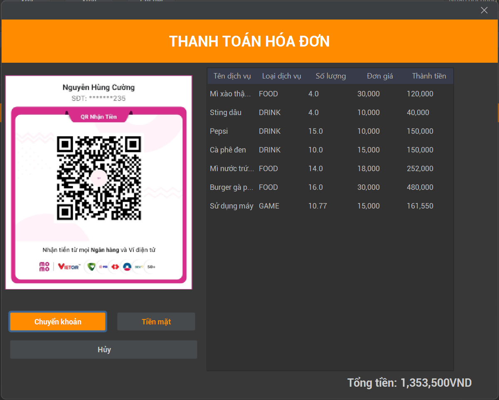
